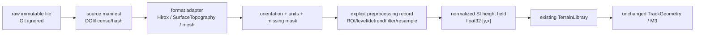

# 公共表面形貌数据审查

审查日期：2026-07-29

机器可读目录：[`data/catalog/public_topography_sources.csv`](../../../data/catalog/public_topography_sources.csv)

许可证清单：[`data/catalog/licenses.csv`](../../../data/catalog/licenses.csv)
砂纸公共 API 探测结果：[`data/catalog/sandpaper_hcgcnm269w_v2_probe.json`](../../../data/catalog/sandpaper_hcgcnm269w_v2_probe.json)

## 1. 审查方法和判定规则

本轮只把以下内容标记为“已获取”：

1. 无需绕过登录、注册或审批即可合法下载；
2. 实际文件已经写入 Git 忽略目录；
3. 文件大小和发布方给出的哈希一致；
4. 解析器实际读出了数组，而不是只看网页预览；
5. 物理尺寸、采样间距和高度单位能从文件或发布方元数据追溯。

四类证据被严格区分：

| 类别 | 本文用语 |
|---|---|
| 仪器输出的数值高程 | measured height map / 实测高程 |
| RGB、显微照片或强度图 | image / 图像，不等同高程 |
| SfM/摄影测量/网格重建 | reconstruction / 重建结果，不作为仪器真值 |
| 论文中的 Ra/Sa/PSD/表格 | reported statistics / 文献统计，不等同原始数据 |

无法公开下载、无法确认单位、无法解析或需要申请的数据均没有写成“已获取”。目录中的 `unknown` 是有意保留，不代表零或“不适用”。

## 2. 结论摘要

| 来源 | 目标材料 | 当前可用性 | 结论 |
|---|---|---|---|
| Mendeley `hcgcnm269w.2` | FEPA P 系列砂纸 | 6 个 Hirox CSV 可直接下载；P80 CSV 未在 127 文件清单中找到 | **当前唯一已端到端验证的目标材料实测高程来源** |
| contact.engineering / Surface-Topography Challenge | CrN/Si 标准样片 | 开放、规模大、格式丰富 | 很适合解析器/统计方法验证，不是目标材料 |
| SurfaceTopography | 软件 | 当前环境未安装 | 值得作为多格式读取后端，不是数据集 |
| Digital Metrology Surface Library | 多种表面 | 注册/登录后下载 | 可做管线样例，许可证和目标材料需登录后核实 |
| RoughnessDatabase.org | 粗糙壁/流动 | 需申请并审批 | 不能自动获取，且目标偏粗糙壁湍流 |
| 红陶砖 Scientific Reports 数据 | 红陶砖 | 作者申请 | 样本设计最有价值，但当前没有文件 |
| Zenodo `18457948` | 抛光混凝土 | 直接下载，8.8 GB | 有 CSV 高程和分割 mask；太大且表面条件有限 |
| Mendeley `28hj2jdy6r.1` | 水泥浆薄片 | 直接下载，多 STL/PLY | 有时序表面网格；单位/采样需文件级核实 |
| Micro-Topo | 多种微观表面 | 直接下载，34.9 MB | 很适合 NPY/metadata 管线测试；未确认包含目标材料 |
| NIST Visible Cement | 水泥/砖内部体数据 | 历史下载路径当前未完整验证 | 是体微结构，不是外露表面高度图 |

## 3. 砂纸基准数据的获取验证

### 3.1 来源与许可

数据集：

- 标题：*Sandpaper Wind Turbine Blade Benchmark Dataset*
- DOI：[10.17632/hcgcnm269w.2](https://doi.org/10.17632/hcgcnm269w.2)
- 发布页：[Mendeley Data version 2](https://data.mendeley.com/datasets/hcgcnm269w/2)
- 许可证：CC BY 4.0
- 发布日期：2020-08-10
- 砂纸体系：发布页明确写为 ISO 6344/FEPA P 系列，列出 P40、P60、P80、P100、P120、P180、P240。

发布页称每个 grit 都有 Hirox RH-2000 的绝对尺度 ground truth CSV。实际匿名公共 API：

```text
https://data.mendeley.com/public-api/datasets/hcgcnm269w
```

返回 127 个文件，但只发现 P40、P60、P100、P120、P180、P240 六个同名 CSV，未发现 `P80.csv`。因此：

- 六个 CSV：`contains_height_map=true`；
- P80：`contains_height_map=unknown`，不能用相邻 grit 代替；
- 发布页与文件清单的冲突已经保留为数据缺口。

Mendeley 的认证 API 路径在匿名探测中返回 HTTP 401；本轮没有绕过认证。公开 `public-api` 和 `public-files` 路径可以合法匿名访问，因此使用后者。

### 3.2 六个 CSV 的文件头验证

仅用 HTTP Range 读取每个文件前 4096 字节，没有大规模下载：

| 文件 | shape `[y,x]` | 采样间距 | 节点跨度 x | 节点跨度 y | 发布方 SHA-256 |
|---|---:|---:|---:|---:|---|
| P40.csv | `[926,8879]` | 1.08954 µm | 9.672936120 mm | 1.007824500 mm | `919ab87e…f83aeb` |
| P60.csv | `[915,11205]` | 1.08954 µm | 12.207206160 mm | 0.995839560 mm | `38d88637…72bb43` |
| P100.csv | `[930,9421]` | 1.08954 µm | 10.263466800 mm | 1.012182660 mm | `a085c14f…e1d18` |
| P120.csv | `[927,8698]` | 1.08954 µm | 9.475729380 mm | 1.008914040 mm | `aab3065a…176e2` |
| P180.csv | `[935,9739]` | 1.08954 µm | 10.609940520 mm | 1.017630360 mm | `3e716caa…e6e8` |
| P240.csv | `[933,9440]` | 1.08954 µm | 10.284168060 mm | 1.015451280 mm | `585fc5e1…fce46` |

“节点跨度”按当前 M1 节点坐标语义计算为 `(N-1) * spacing`。如果发布方把视场定义为 `N * pixel pitch`，两者会相差一个采样间距；因此目录保留了计算口径。

文件头明确：

- `Calibration,1.08954μm/pxl`
- `Height Unit,μm`
- `X size,...`
- `Y size,...`

横向采样间距不是仪器横向分辨能力，`Height Unit` 也不是垂直分辨率。数据集没有给出可核实的垂直分辨率，所以该字段为 `unknown`。

### 3.3 P240 端到端解析

选择 68,515,861 B 的 P240 作为最小已定位砂纸 CSV 样例；同时下载 2,092 B 的 `ReadMe.txt`。二者存放在：

```text
data/raw/mendeley_hcgcnm269w_v2/
```

该目录被 Git 忽略。实际 SHA-256：

- P240 CSV：`585fc5e128689f5444b32996703c2d38b103a7c34465d0ed0dc81f269e7fce46`
- README：`ced061a185abf5f232b836f69ddfa1b25562735cc68013fbda8104170d4d9981`

完整清单见 [`file_hashes.sha256`](../../../data/catalog/file_hashes.sha256)。

解析结果：

| 项目 | 结果 |
|---|---:|
| 数组 shape `[y,x]` | `[933,9440]` |
| 物理节点跨度 x | 0.01028416806 m |
| 物理节点跨度 y | 0.00101545128 m |
| 横向采样间距 x/y | 1.08954e-6 m |
| 文件高度单位 | µm |
| 标准化输出单位 | m |
| 缺失值数量/比例 | 0 / 0 |
| 最小高度 | 0 m |
| 最大高度 | 2.91461e-4 m |
| 平均高度 | 1.9723696541e-4 m |
| 相对零点 RMS | 2.0300219299e-4 m |
| 去均值 RMS（未调平） | 4.8036130509e-5 m |

机器可读摘要和预览由数据探测脚本生成到 Git 忽略的
`reports/terrain_phase01/`；原始数据与可复核目录信息分别保存在 Git 忽略的
`data/raw/` 和版本化的 `data/catalog/`。

预览揭示两个不能忽略的问题：

1. 有明显的大尺度倾斜/形状趋势；
2. 上、下边界出现零值带。

解析器没有把零自动当缺失，也没有裁边、调平、滤波或填充。这是证据层的刻意行为。P240 已证明“可自动下载并解析”，但**尚未证明整个矩阵可直接用于材料统计标定**。

## 4. contact.engineering、TopoBank 与 Surface-Topography Challenge

### 4.1 contact.engineering

[contact.engineering](https://contact.engineering/) 是发布、共享和分析 surface digital twin 的平台。公开条目的材料、仪器、文件和许可证逐条变化，不能假设平台上的所有数据都采用同一许可。

本轮没有在公开目录中验证到可直接作为红砖、普通混凝土或砂纸标定样本的具体条目，因此将它列为：

- 高价值发现入口；
- 高价值标准格式和统计管线来源；
- 尚非已确认目标材料数据。

“TopoBank”在可访问的官方资料中未找到一个可单独核实、具有独立下载清单和许可证的当前目标材料仓库；本目录把它按 contact.engineering 生态/历史名称处理，没有伪造独立数据集记录。

### 4.2 Surface-Topography Challenge

公开挑战页报告：

- 2 个表面；
- 2,088 次测量；
- 153 名参与者；
- 63 家公司、国家实验室或高校；
- 20 个国家。

来源：[challenge page](https://contact.engineering/challenge/)

归档：

- Zenodo：[10.5281/zenodo.15341939](https://doi.org/10.5281/zenodo.15341939)
- 论文：[10.1007/s11249-025-02014-y](https://doi.org/10.1007/s11249-025-02014-y)

材料是两个 CrN 涂层硅片表面（光滑/粗糙），不是目标材料。Zenodo 文件包括：

- 原始仪器格式；
- 规范化 NetCDF；
- `meta.yml`；
- 报告和最终 RMS/PSD 表；
- 多个数 GB 到近 10 GB 的顶层 archive。

Zenodo 记录标为 CC0，但根 README 说明每个 digital surface twin 内有自己的许可证文件，因此正式使用前仍需检查所选容器。未进行大型下载。

它最适合：

- 验证 SurfaceTopography 的多仪器解析；
- 单位转换、mask、非均匀/均匀数据处理；
- 跨仪器 PSD/RMS 可重复性；
- 不适合直接标定红砖、混凝土或砂纸。

## 5. SurfaceTopography 软件包

[SurfaceTopography PyPI](https://pypi.org/project/SurfaceTopography/) 和 [GitHub](https://github.com/ContactEngineering/SurfaceTopography) 显示：

- 当前核实版本：1.22.0（2026-05-08）；
- Python `>=3.10`；
- MIT 许可证；
- 支持 35+ 仪器/标准格式，包括 NetCDF、X3P、OS3D、XYZ、NPY、OPD、VK、PLU 等；
- 提供 RMS、PSD、自相关等分析。

当前项目环境的实际探测结果：

```json
{
  "available": false,
  "status": "not_installed",
  "error": "ModuleNotFoundError: No module named 'SurfaceTopography'"
}
```

本轮没有在 ADR 之前把它加入正式依赖。选择建议见
[`ADR-001-topography-file-ingestion.md`](../../decisions/ADR-001-topography-file-ingestion.md)。

## 6. 其他数据源

### 6.1 Digital Metrology Surface Library

[公开说明页](https://digitalmetrology.com/surface-library/)确认：

- 3D areal 数据使用 `.os3d`；
- 条目列出采集仪器和文件大小；
- 首次访问必须注册，下载前必须登录；
- 注册后可下载多个数据。

公开页没有给出可核实的数据许可证，也没有证明包含目标材料。未注册、未绕过登录、未把它写成已获取。

### 6.2 RoughnessDatabase.org

[用户访问页](https://roughnessdatabase.org/user-access/)明确说明必须提交申请，审批后才能浏览和下载 surface profiles、surface statistics 和 flow measurements。

因此：

- `direct_download=false`；
- 当前没有获得目录内容；
- 许可证 `unknown`；
- 更偏向湍流粗糙壁，不自动等价于微刺接触用材料表面。

### 6.3 红陶砖

[Scientific Reports 论文](https://www.nature.com/articles/s41598-022-04847-2)（DOI
[10.1038/s41598-022-04847-2](https://doi.org/10.1038/s41598-022-04847-2)）提供了目前最有价值的红陶砖样本设计证据：

- 5 家砖厂；
- 每家 10 块，共 50 块；
- 500 个红陶瓷基底样本；
- Starrett AV300+；
- X/Y 指标 `E2 = 1.9 µm + 5L/1000`；
- Z 指标 `E1 = 2.5 µm + 5L/1000`；
- 标尺分辨率 0.1 µm。

论文的数据可用性声明是“向通讯作者申请后免费提供”。当前：

- 公开直接可下载文件数：0；
- 文件格式：`unknown`；
- 原始/处理状态：`unknown`；
- 许可证/供数条件：`unknown`。

在作者提供原始点云及 per-sample 元数据后，这批数据可能覆盖跨砖厂/工艺差异；在此之前不能把论文表格当作高度图。

另有 [building-material surface-topography study](https://doi.org/10.1088/2051-672X/4/3/035003)涉及红砖和风化混凝土，但本轮没有核实到公开原始高程、单位、采样或许可，因此仅列为文献证据。

### 6.4 混凝土 CLSM 高程

Zenodo
[10.5281/zenodo.18457948](https://doi.org/10.5281/zenodo.18457948) 明确包含：

- 抛光混凝土 RGB；
- 对应 CSV height mappings；
- 气孔、骨料和水泥浆 segmentation masks；
- 240x 子集的横向采样 0.69 µm/pixel；
- CC BY 4.0。

当前版本约 8.8 GB，包含高度的最小归档仍约 1.5 GB。因此本轮只验证 Zenodo API 元数据和文件清单，没有大规模下载。它非常适合：

- 抛光混凝土微观高度；
- 高度与孔/骨料标签联合统计；
- 管线和材料分区试验。

限制：

- 抛光面不代表浇筑面、劈裂面、风化墙面或暴露骨料面；
- 页面没有充分说明 CSV 高度单位和垂直分辨率，必须在文件级验证；
- 当前不能给出 specimen/patch 的可信计数。

### 6.5 水泥浆时序 mesh/point cloud

Mendeley
[10.17632/28hj2jdy6r.1](https://doi.org/10.17632/28hj2jdy6r.1) 提供：

- 水胶比 0.4、厚 0.5 mm 的水泥浆薄片；
- 水或石蜡持续浸泡；
- Olympus 3D Laser Confocal Microscope；
- 每天每条件 5 个样本；
- 原始 STL、Meshmixer 裁剪 STL、PLY 点云、MIX、XLSX 和 MATLAB；
- CC BY 4.0。

它是合法直接下载的真实表面数据，但不是规则高度场，且文件清单很大。单位、mesh 坐标、孔洞/底座裁剪和部分采集失败必须先审计。它不能直接代表普通混凝土外墙。

### 6.6 Micro-Topo

[Micro-Topo-Dataset](https://data.uni-hannover.de/dataset/micro-topo)，DOI
[10.25835/pngok8op](https://doi.org/10.25835/pngok8op)：

- Keyence VK-X210 共焦激光显微镜；
- NPY height image、laser intensity、RGB 和合成图；
- CSV metadata 和示例 notebook；
- 总体约 34.9 MB；
- CC BY-NC 3.0。

它非常适合作为 NPY + metadata 的小型管线测试，但公开页面没有证明其中包含目标材料。非商业限制需项目负责人确认。

### 6.7 水泥浆文献数据

[10.1016/j.matchar.2014.11.033](https://doi.org/10.1016/j.matchar.2014.11.033)
和后续几何分析报道：

- CEM I-52.5R、w/c 0.4；
- 抛光/未抛光；
- CSI 横向采样约 0.45 µm、视场约 184 × 138 µm；
- SCM 横向采样约 2 µm；
- 不同垂直准确度/分辨率。

本轮没有发现可公开下载的原始高度图，所以只能用于设计测量尺度和交叉仪器要求，不能用于拟合。

### 6.8 NIST Visible Cement

[NIST 说明](https://www.nist.gov/publications/visible-cement-data-set)称该集合含水化水泥浆、石膏和一块普通建筑砖的同步辐射 X 射线微断层数据，体素小于 1 µm。

这是内部三维微结构体数据，不是外露表面高程；历史下载站、当前文件访问和数据文件许可证也没有在本轮完整验证。它不纳入外表面标定样本。

## 7. 数据目录字段解释

机器可读 CSV 使用任务要求的 36 个字段。填写规则：

- 所有无法由发布页、API、文件头或论文核实的字段写 `unknown`；
- `field_of_view_*` 对 Hirox 文件明确写成 node span；
- `lateral_resolution_*` 沿用任务字段名，但值实际是文件声明的 sampling interval 时，会在限制中说明；
- `contains_absolute_scale` 只有来源明确声明或文件单位/spacing 完整时才为 true；
- `direct_download=true` 不代表已经下载；
- `suitability_for_calibration` 区分“可直接拟合”“需 QC/预处理”“仅管线测试”和“不适用”；
- `evidence` 使用发布页、DOI、API 或本地探测结果，不使用搜索结果页。

CSV 已通过结构化导入验证：

- 20 行（1 个表头 + 19 个记录）；
- 36 列；
- 每行列数一致；
- 数据集 ID 无重复；
- `checked_date` 全部为 2026-07-29。

## 8. 建议的数据证据层

不改变 M3 成品格式，在真实数据与 `TerrainLibrary` 之间增加来源标准化层：



每个标准化高度场至少要记录：

- dataset/source/file ID；
- DOI、发布页、许可证、访问方式；
- 原始文件 SHA-256、大小、格式；
- instrument、specimen、batch、surface finish、condition；
- 原始轴顺序、行方向、手性、z 正方向；
- 原始 coordinate/height unit；
- shape、origin、spacing 或显式坐标；
- missing-value mask 和缺失率；
- 每一步裁剪、调平、去趋势、异常点、填补、滤波和重采样；
- 处理代码版本和参数；
- 标准化数组 SHA-256；
- 是否保持绝对高度零点；
- 可以/不可以用于哪些统计和 M3 验证。

原始文件永不因解析而改写；每个处理结果必须由原始哈希和处理记录可重建。最终输出仍是现有二维 SI 高度场和 `TrackGeometry`。
