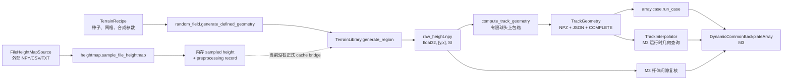

# M1 地形模块现状审计

审计日期：2026-07-29

范围：`src/spine_sim/terrain`、地形相关配置/测试/文档，以及 M2/M3 中读取地形的代码。
兼容性原则：项目负责人已明确不再开发 M2；本轮以**正在修改的 M3**为唯一兼容权威。M2 只记录当前事实，不作为设计目标。本轮没有修改 M2、M3 或最终地形生成算法。

## 1. 结论

当前 M1 的核心存储是规则二维高度场（2.5D，`z = h(x,y)`），不是点云、三角网格或体素。它足以表达 M3 当前使用的、从上方可达的外露表面，包括可见凹坑和沟槽；不能表达倒扣、悬垂、多值高度、孔洞内部侧壁或封闭空腔。项目负责人已说明隐藏凹陷空洞不属于本轮要求，因此无需改变成品地形格式。

M1 与 M3 之间实际上有两层契约：

1. `TerrainLibrary.open_region()` 返回只读、规则网格、`float32`、单位为米的二维高度数组，M3 用它做杆体间隙复核；
2. 每根刺对应一个 `TrackGeometry`，M3/M3 所调用的几何插值层使用有限球头包络高度、x 坡度、支撑点、有效掩码和近并列标志。

因此后续可以改变“真实数据如何导入、材料模型如何标定、二维高度场如何生成”，但必须保持这两层的字段、单位、坐标方向、数组语义、ID 和缓存行为不变。

现有 `defined_geometry` 随机场是坐标可寻址的、经高斯核滤波的合成验证地形。它没有红砖、混凝土或砂纸测量来源，**不得称为这些真实材料的生成模型**。默认 RMS、相关长度和采样间距是工程/验证配置，不是实测材料参数。

## 2. 模块依赖图与数据流



数据流的物理含义：

```text
生成/测量源
  -> 统一到 z=h(x,y) 的 SI 规则网格
  -> 持久化二维区域
  -> 按球头半径和全局 y 位置求有限球头包络
  -> 每根刺的一维 TrackGeometry
  -> M3 阵列动力学、支撑点与杆体间隙检查
```

上述测量源路径中的“持久化二维区域”是下一阶段所需的数据层边界，不是当前已经完整连通的功能。现有 `sample_file_heightmap()` 只返回内存数组和 preprocessing record；`TerrainLibrary.generate_region()` 仍只接受 `defined_geometry` recipe。当前没有把 `FileHeightMapSource` 的处理结果正式注册为可被 M3 打开的 region。

主要代码证据：

- 地形数据模型：`src/spine_sim/terrain/models.py`
- 规则网格生成：`src/spine_sim/terrain/random_field.py`
- 外部高度图：`src/spine_sim/terrain/heightmap.py`
- 球头包络：`src/spine_sim/terrain/envelope.py`
- 存储与缓存：`src/spine_sim/terrain/library.py`
- M3 装载入口及杆体间隙：`src/spine_sim/array/case.py`
- M3 阵列构造和一致性检查：`src/spine_sim/array/dynamics.py`
- M3 当前调用的插值几何：`src/spine_sim/contact/geometry.py`

## 3. 当前地形表示形式

| 表示 | 当前状态 | 用途 |
|---|---|---|
| 1D profile | 派生存在 | `TrackGeometry` 是固定全局 y、指定球头半径对应的一维可接触轨道，不是原始测量剖面 |
| 2D height field | **主表示** | 区域地形、文件高度图、解析几何测试面 |
| point cloud | 不支持 | `FileHeightMapSource` 不读取 XYZ/PLY |
| triangle mesh | 不支持 | 不读取 STL/OBJ，也不保存表面三角形 |
| voxel/SDF | 不支持 | 无实体内部、倒扣或封闭孔洞表示 |
| 2D sphere envelope | 调试/验证存在 | `SphereEnvelope2D`，正式 M3 使用一维 `TrackGeometry` |

节点坐标没有保存为全局 `meshgrid`。区域只保存 origin、spacing、shape，坐标按需计算：

```text
x[j] = origin_x_m + j * resolution_x_m
y[i] = origin_y_m + i * resolution_y_m
height[i, j] = z(x[j], y[i])
```

这是一种 2.5D 外露上表面表示。一个 `(x,y)` 位置不能对应多个 `z`。

## 4. 坐标、单位和表面法向

| 项目 | 当前定义 | 审计判断 |
|---|---|---|
| 数值单位 | API 内部统一 SI；坐标、长度、半径、高度为 m；坡度无量纲 | 主路径清楚 |
| 数组轴 | `[y, x]`；行沿 y，列沿 x | M1 内一致 |
| 坐标约定 | `global_xy_nodes_origin_aligned` | recipe 强制校验 |
| z 方向 | 高度增大解释为向上 | 代码中是隐含约定，元数据未单独记录 |
| M3 拖动方向 | 全局 `+x` | 与 `envelope_slope_x` 一致 |
| y 方向 | 阵列横向；track 的 y 必须匹配 holder 全局 y | M3 以 `1e-12 m` 绝对容差检查 |
| x-z 切平面切向 | `(1, slope) / hypot(1,slope)` | 由插值层即时计算 |
| x-z 切平面法向 | `(-slope, 1) / hypot(1,slope)` | 指向 `+z` |

缺口：

- 外部文件元数据没有显式的行方向（第一行是 `y_min` 还是 `y_max`）、x/y 镜像、z 正方向或手性；
- 文件高度图只接受调用者已经换算好的米制 spacing/origin，高度单位单独记录，但原始坐标单位和仪器坐标系没有完整证据链；
- M3 的一维 track 不包含 y 坡度，因此法向是 x-z 截面法向，而非完整三维表面法向。

## 5. M1 向下游提供的数据

### 5.1 二维区域

`TerrainLibrary` 持久化：

- `raw_height.npy`：`float32` 二维数组；
- recipe JSON；
- region manifest JSON：recipe/region ID、origin、size、resolution、shape、dtype、坐标存储方式、哈希等；
- `COMPLETE` 标志：最后写入，表示原子生成完成。

二维区域没有直接提供：

- normal；
- slope；
- curvature；
- concavity；
- accessibility；
- contact candidates；
- mesh；
- pore/aggregate/material masks。

### 5.2 `TrackGeometry`

| 字段 | 单位/类型 | 语义 | M3 是否依赖 |
|---|---|---|---|
| `terrain_recipe_id` | string | 生成/来源 recipe 身份 | 是 |
| `region_id` | string | 二维区域身份 | 是 |
| `track_id` | string | recipe、region、半径、y、算法、分辨率共同决定 | 输出追踪 |
| `radius_m` | m | 有限球头半径 | 是 |
| `y_global_m` | m | 刺所在的全局 y | 是 |
| `resolution_m` | m | 一维 x 采样间距 | 间接用于配置与追踪 |
| `envelope_algorithm_version` | string | 包络实现版本 | 缓存身份/追踪 |
| `x_global_m` | m, 1D | 严格递增查询坐标 | 是 |
| `envelope_height_m` | m, 1D | 球心在每个 x 的最低无穿透高度 | 是 |
| `envelope_slope_x` | dimensionless, 1D | 包络关于 x 的坡度 | 是 |
| `support_x_m` | m, 1D | 产生包络最大值的地形支撑点 x | 是 |
| `support_y_m` | m, 1D | 支撑点 y | 是 |
| `valid_mask` | bool, 1D | 完整球头支持域是否有效 | 是 |
| `near_tie_flag` | bool, 1D | 第一、第二包络候选接近 | 是 |
| `model_warning` | string/None | 模型告警 | 当前 M3 不参与动力学计算 |

注意：`support_x_m/y_m` 是球头包络的几何支撑点，不是已经通过摩擦、法向力或可挂接条件筛选的“接触候选列表”。

### 5.3 `SphereEnvelope2D`

调试/验证结构另含：

- `envelope_slope_y`；
- 二维 `envelope_height_m`、`support_x_m/y_m`、`valid_mask`、`near_tie_flag`。

它没有作为正式 M3 输入。

## 6. M3 的实际依赖

### 6.1 构造时不变量

`DynamicCommonBackplateArray` 当前要求：

- 每个 pin 恰好一个 `TrackGeometry`；
- 所有 track 的 `terrain_recipe_id` 相同；
- 所有 track 的 `region_id` 相同；
- 每个 track 的 `y_global_m` 与 pin 全局 holder y 一致；
- track 半径与该 pin 的 tip radius 一致。

### 6.2 运行时几何查询

`TrackInterpolator` 要求：

- `x_global_m` 有限且严格递增；
- 查询区间两侧 `valid_mask` 都为真；
- 对 `envelope_height_m`、`envelope_slope_x`、`support_x_m`、`support_y_m` 做线性插值；
- 用 `radius_m`、track y 和支撑 x/y 反求支撑点 z；
- 从坡度构造 x-z 切向和向上法向；
- 合并相邻节点的 `near_tie_flag`。

M3 随后使用包络高度计算 gap、接触激活和动力学，用支撑点计算几何/杆体相关量。

### 6.3 M3 对二维区域的额外依赖

`array.case` 的杆体间隙后检查绕过一维 track，重新通过：

- `TerrainLibrary.open_region(terrain_recipe_id, region_id)`；
- `TerrainLibrary.load_region_spec(...)`；
- 二维高度场双线性插值。

因此只保留 `TrackGeometry` 还不够。二维区域的路径、shape、origin、spacing、单位和只读打开行为也属于 M1→M3 契约。

### 6.4 M1 修改时禁止破坏的兼容边界

后续材料地形实现必须满足：

1. 标准化结果仍为节点中心规则二维高度场，数组轴 `[y,x]`，高度单位 m；
2. 区域缓存仍可由现有 `TerrainLibrary` 打开，且 manifest 能重建 `RegionSpec`；
3. `TrackGeometry` 字段和物理含义不变；
4. 有效域边界、球头支撑点和近并列语义不变；
5. track/region/recipe ID 对同一输入稳定，且来源/预处理变化必须改变身份；
6. 不在 M3 内分支判断“合成/砂纸/红砖/混凝土”；
7. M3 正在并行修改期间，不由 M1 工作擅自修改 M3 文件。

## 7. M2 依赖（只记录现状）

当前 M2 的 `TrackInterpolator` 同样读取 `TrackGeometry` 的 x、包络高度、x 坡度、支撑 x/y、有效掩码、近并列标志、半径和 track y。M3 当前也复用了这一几何层。

本轮及后续 M1 工作不再以 M2 为功能目标，不修改 M2 接触、阵列或求解逻辑；此节仅满足现状审计的可追溯性要求。

## 8. 随机种子、缓存、文件存储和批量机制

### 8.1 随机性

- `TerrainRecipe.seed` 是显式字段；
- 坐标噪声采用 coordinate-addressed SplitMix64；
- 同一 recipe、全局坐标和算法版本应得到相同结果；
- 分块顺序不改变地形；
- 高斯核按 x/y 分离卷积，截断在约 3 个相关尺度；
- 默认合成参数：目标 RMS `30 µm`，x/y 相关长度各 `50 µm`；
- canonical spacing `5 µm`，production spacing `10 µm`，后者固定为 stride 2。

这些默认值没有材料测量来源，不能解释为红砖、混凝土或砂纸参数。

### 8.2 缓存与原子性

`TerrainLibrary` 使用如下目录：

```text
recipes/
sources/
regions/<recipe>/<region>/
tracks/<recipe>/<region>/<radius>/
manifests/
validation/
```

主要行为：

- 临时文件完成后 `replace`；
- 区域数据和 track 数据都有哈希；
- `COMPLETE` 最后写入；
- 区域以 `.npy` 保存并用 `mmap_mode="r"` 打开；
- track 以压缩 NPZ + JSON + complete marker 保存；
- track ID 包含 recipe、region、tip radius、global y、算法版本和分辨率；
- 删除区域缓存时可保留 recipe/manifest，依赖坐标寻址随机场重建；
- `open_region(..., verify_hash=True)` 可复核区域哈希，track 装载会复核身份/内容。

### 8.3 批量任务

- `generate_formal_terrain_batch` 按 seed/条件生成区域和 tracks，并在每个 seed 后写运行报告；
- `generate_terrain_suite` 生成固定的验证条件集合；
- 中断时报告保留 `running/interrupted` 语义，但没有通用任务队列、跨进程锁或内容寻址对象存储；
- 缓存命中是主要的恢复机制；
- 大规模 campaign 的并行调度属于更高层运行时，不是 M1 数据格式本身。

## 9. 网格尺寸、物理窗口和内存复杂度

当前 campaign 设计的最大正式区域：

| 项目 | 数值 |
|---|---:|
| 物理窗口 x | 147.960 mm |
| 物理窗口 y | 40.200 mm |
| production spacing | 10 µm |
| 节点 shape `[y,x]` | `[4021, 14797]` |
| `float32` payload | 237,994,948 B = 226.97 MiB |

若同一窗口完整保留 5 µm canonical 网格：

| 项目 | 数值 |
|---|---:|
| 节点 shape `[y,x]` | `[8041, 29593]` |
| `float32` payload | 951,829,252 B = 907.74 MiB |

复杂度：

- 高度场存储：`O(Nx * Ny)`；
- 一条 track：`O(Nx)`；
- 正式 track 包络对有限球头偏移集合逐项更新，时间近似 `O(Nx * K)`，K 由球头半径/网格决定；
- 调试用完整二维包络：内存 `O(Nx * Ny)`，并含 best/second/support/valid/slope 等多个全尺寸数组；
- 文件高度图的 CSV/TXT 加载和 detrend 当前会转成 `float64`；平面 detrend 还会构造与节点数成比例的设计矩阵，是大型实测图的风险点；
- 区域正式生成按行 tile 写入，不创建全局 meshgrid，降低坐标数组开销。

本轮实测 P240 为 `[933,9440]`，约 8.81 M 节点。原始 `float64` 读取约 67.2 MiB；若标准化为 `float32` 高度场约 33.6 MiB。

## 10. 问题与风险分级

| 等级 | 问题 | 证据/影响 | 建议 |
|---|---|---|---|
| 高 | 现有合成场无材料标定 | 默认 RMS/相关长度来自代码配置，无 DOI/样本 | 保留为验证夹具，不命名为真实材料 |
| 高 | 10 µm production 网格对微刺接触是否收敛未知 | 真实 P240 横向采样为 1.08954 µm；峰顶、坡度和曲率可能被降采样抹平 | 做 1/2/5/10 µm 的 M3 接触统计收敛研究 |
| 高 | 实测文件轴方向、z 正方向、缺失值语义未进入正式 schema | 错误镜像/翻转会改变顺逆向挂接统计 | 在数据层强制记录，不允许默认猜测 |
| 高 | `FileHeightMapSource` 尚未连到正式 region cache | 可以采样外部矩阵，但 M3 不能通过当前正式 case 路径直接使用该结果 | 下一阶段增加 provenance-preserving cache bridge，保持 M3 读取接口不变 |
| 高 | 真实数据覆盖严重不足 | 砂纸每 grit 仅单 patch；红砖公开原始文件为 0；普通混凝土外露表面不足 | 见数据缺口报告 |
| 高 | M3 正在并行修改，契约可能漂移 | 工作树中的 M3 文件已有用户修改 | 只读重审 M3；以接口测试和字段语义为闸门 |
| 中 | 二维高度场不表示倒扣/隐藏空洞 | 2.5D 的固有限制 | 已由项目负责人确认不要求；在适用域中明确声明 |
| 中 | 地形生成与球头几何耦合 | M1 以 tip radius/y 生成 track | 保留稳定转换层；材料模型只产二维高度场 |
| 中 | 每个 y/半径重复求包络 | 多 pin、多半径增加计算量 | 先测量缓存命中和批量性能，再设计复用 |
| 中 | CSV/TXT 全量 `float64` 读取 | 大型仪器文件会造成内存峰值 | 数据入口采用流式/分块或专用读取器 |
| 中 | `SphereEnvelope2D` 多个全局数组 | 大区域内存显著高于单一高度场 | 仅用于受控窗口验证 |
| 中 | 来源/许可证不是正式 M1 source 元数据字段 | 无法从 region 回溯 DOI、license、原始哈希和预处理 | 下一阶段扩展 recipe/source manifest，保持 region/track 消费接口不变 |
| 中 | 仅规则、等距、有限二维数组 | 非均匀轮廓、点云、mesh、NaN 当前不能直接注册 | 先标准化到统一高度场，并保存转换证据 |
| 低 | SI 主路径与 CLI 展示单位并存 | CLI/文档用 mm/µm 后手工换算 | 保留显式单位后缀和边界校验 |
| 低 | 可视化的“groove”等区域是启发式 | 不能作为材料物理验证 | 标记为可视化，不用于校准 |

## 11. 测试覆盖审计

已有优点：

- recipe/region/track 身份和确定性测试；
- tile 与整窗重叠一致性；
- 5/10 µm 规则；
- 缓存、哈希、重建和 mmap 测试；
- 平面、斜面、凸起、正弦等解析包络测试；
- M2/M3 已有集成测试使用 `TrackGeometry`。

缺失项：

- 真实仪器文件的回归 fixture；
- 行方向、x/y 翻转和 z 正方向测试；
- NaN、空字段、无效值掩码策略；
- 非均匀点云/mesh 标准化；
- 实测单位和 metadata round-trip；
- 抗混叠降采样与多分辨率 M3 接触统计收敛；
- 用同一爪刺模型比较真实/生成表面的挂接、滑移、承载和失效分布；
- 多批次材料统计和留出验证；
- 许可证/DOI/哈希随 region/track 的可追溯性。

本轮新增的 `tests/test_terrain_data_probe.py` 只验证证据层的 Hirox CSV 头、矩阵 shape、单位、缺失统计和错误处理；它不实现最终生成器。

## 12. 审计后的接口决定

当前存储形式可以继续使用，但正式适用域应写成：

> 规则二维、单值高度、无倒扣的外露上表面；接触对象从 `+z` 一侧接近。

下一阶段的数据导入或材料生成器应位于 M3 上游：

```text
measured/source-specific data
  -> provenance-preserving normalization
  -> regular SI height field
  -> existing TerrainLibrary + envelope
  -> unchanged M3 contract
```

是否把 10 µm 作为正式生产分辨率、如何调平/裁边以及允许哪些材料子类型，均需依据真实数据和 M3 收敛结果决定，不能在本轮硬编码。
